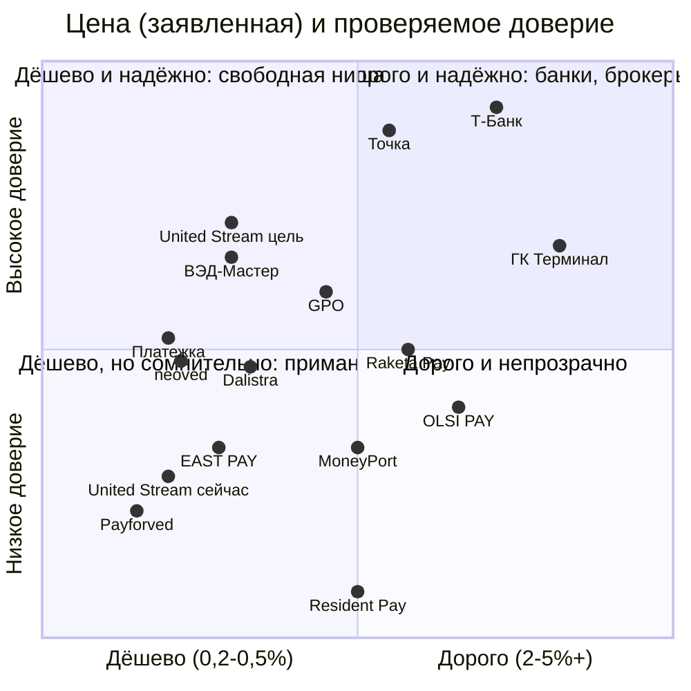

# Досье: рынок платёжных агентов для B2B-платежей за рубеж (кроме А7 и нишевых китайских агентов)

*Дата среза: 24.09.2026.*

*Метод. Около 44 запросов WebSearch при лимите 75. Инструмент иногда сам выполнял дополнительные подзапросы, поэтому один вызов засчитан как 4. Около 60 страниц прочитаны напрямую через curl (лимит не расходуют): главные страницы, страницы «о компании», реквизиты, политики конфиденциальности и оферты, партнёрские программы, отраслевые статьи. Title и H1 взяты из HTML напрямую.*

*Perplexity недоступен: коннектора в сессии нет.*

*Ограничения:*
- *Сайты банков (tbank.ru, secrets.tbank.ru, tochka.com, allo.tochka.com, psbank.ru) напрямую не открываются. Их сертификаты выпущены НУЦ Минцифры (Russian Trusted Root CA), а его нет в хранилище доверия прокси. WebFetch по этим адресам возвращает 503. Данные по банкам взяты только из сниппетов выдачи, это вторичный источник.*
- *Реестры юрлиц (checko, rusprofile, list-org, zachestnyibiznes, egrul.itsoft) из этой среды отдают 403 или капчу. ИНН и ОГРН взяты только с сайтов самих компаний. Год регистрации восстановлен по ОГРН: 4–5-я цифры означают год.*
- *exnode.ru, vedhonest.com и ru.investing.com отдают заглушку (JS или 403).*
- *WebSearch работает на американском индексе, а не на Яндексе, поэтому позиции в выдаче ориентировочные.*
- *Цифры масштаба у всех игроков взяты из их собственных заявлений. Независимо их проверить не удалось.*

Обозначения: **[Ф]** факт со ссылкой, **[О]** оценка, **[В]** вывод для маркетинга.

---

## 1. Главное

1. **[Ф] Рынок большой, и цены на нём падают.** По оценке Точки, в апреле 2026 года через агентов проходило около 60% валютных операций бизнеса, хотя в 2024 году эта доля была не больше 1%. По данным Совкомбанка, через агентов идёт до 85% оборота. Средняя комиссия опустилась до 2% и ниже, а в 2023–2024 годах была 5–10% и выше. Структура по направлениям: Китай 59% агентских переводов, Турция 15%, Гонконг 11%, Корея 4%, Тайвань 3% ([Известия через tks.ru, 05.05.2026](https://www.tks.ru/reviews/2026/05/05/0011/komissiya-vyipolnima-platezhi-za-granitsu-podesheveli-no-stali-slozhnee/); [Клерк, 05.05.2026](https://www.klerk.ru/buh/news/690266/)). **[В]** Раз цена падает, «низкая комиссия» перестаёт отличать одного агента от другого. Выигрывать будут доверие, гарантии и маршруты.
2. **[Ф] Рынок делится на шесть кластеров** (§2.1):
   - банки-агрегаторы: Т-Банк, Точка, ПСБ;
   - «белые» финтех-агенты: neoved, Dalistra, Платежка, GPO, ВЭД-Мастер, Raketa Pay, OLSI PAY, AgentPayout;
   - агенты при таможенных брокерах и логистах: ГК «Терминал», КВТ-Эксперт, КастомСервис, СПИ-ГРУПП;
   - гибриды B2C, B2B и крипты: MoneyPort, NoWall, EAST PAY, Resident Pay, Payforved;
   - серый сегмент: Global Finance VED, GPAgent, Onex, Доверка и другие;
   - мониторинги и агрегаторы: Exnode, VedHonest.

   United Stream стоит в кластере «белых» финтех-агентов, но доказательств доверия у него меньше, чем у соседей.
3. **[Ф] Выдачу по запросам «ТОП/рейтинг платёжных агентов 2026» почти целиком заняли Exnode и криптообменники.** В «рейтингах» на vc.ru, DTF, Хабре, altcoinlog и Sostav первые места занимают Onex, Доверка, Global Finance VED, RSI Capital, NNEX, SwiftOK, Win Win, Insight, BitOkk, EastPay. Настоящих B2B-лидеров (Т-Банк, Точка, neoved, Dalistra, Платежка, ВЭД-Мастер) там почти нет ([altcoinlog](https://altcoinlog.com/reiting-agentov-mezhdunarodnyh-platezhei/), [DTF](https://dtf.ru/hard/4537724-top-platezhnykh-agentov-2026-goda), [DTF](https://dtf.ru/flood/3859177-platezhnye-agenty-dlya-biznesa-v-rossii), [vc.ru](https://vc.ru/money/2980387-reestr-platezhnykh-agentov), [Хабр/Exnode](https://habr.com/ru/companies/Exnode/articles/1084202/)). **[В]** Место в таких подборках покупается. Сама подборка ничего не доказывает, но даёт видимость по высокочастотным запросам.
4. **[Ф] Большинство конкурентов, как и United Stream, заключают договор через иностранную компанию или её обособленное подразделение с ИНН 9909…:**
   - Dalistra: турецкая DIMMAR PROPERTY … LIMITED SIRKETI;
   - MoneyPort: индийская MONEYPORT CAPITAL PRIVATE LIMITED;
   - Raketa Pay: ООО «РОСКЕТ СМАРТ», ИНН 9909763341, при LLC ROCKET SMART из Ташкента;
   - Платежка: «российский филиал гонконгской компании», счёт 40807.

   Российское юрлицо открыто указывают только ВЭД-Мастер (АО, ИНН 9709114653), GPO (ООО «ГлобалПО») и брокеры. **[В]** Иностранный контрагент — норма рынка, а не уникальная слабость United Stream. Слабость в том, что это не объяснено. Честная страница «кто подписывает договор и почему это безопасно» на рынке пока пустует.
5. **[Ф] Разрыв между рекламной ценой и реальной встречается повсеместно:**
   - Payforved: в meta «0,2%», в FAQ 1,5–3,5%;
   - Dalistra: «от 0,5%», в FAQ «для постоянных клиентов от 1,5%»;
   - neoved: 0,3% (FAQ), 0,5% (meta) и 0,75% (старый сниппет), плюс «курс ЦБ +1%»;
   - Т-Банк: Китай «от 0,3%», остальные страны 2,5–5,5%.

   Публичную сетку с примером расчёта дают немногие: OLSI PAY (фикс 2,5% «всё включено»), AgentPayout (пример 1,8%), СПИ-ГРУПП («курс + 20%»). **[В]** Главное доступное отличие для United Stream — прозрачная тарифная сетка.
6. **[Ф] Какие обещания стали общим местом, по выборке из 19 игроков (§2.5):**
   - фиксация курса до оплаты — 14 из 19;
   - «без скрытых комиссий» — 12;
   - срок «от N часов/минут» или «за 24 часа» — около 10;
   - «от 0,3%» и ниже в заголовке — 5 (плюс United Stream и А7);
   - «150+ стран» — только 2 (NoWall 170+, Платежка 100+/200+).

   Честная норма рынка по географии — «50+ стран» (Dalistra, ВЭД-Мастер, AgentPayout). **[В]** Формула «0,3% · 24 часа · 150 стран» в сумме звучит как обещание обменника, а не банка. Верить ей будут меньше, чем цифрам с условиями.
7. **[Ф] Партнёрские программы есть у 6 из 19 игроков.** Размер и форма вознаграждения:
   - neoved: до 0,5% с контракта, в среднем около 15 000 ₽ за транзакцию, выплаты 6 месяцев;
   - MoneyPort: 0,3% с каждого перевода или реселлинг со своей наценкой;
   - Dalistra: white-label, партнёр сам назначает цену;
   - ВЭД-Мастер: процент от комиссии, личный кабинет;
   - GPO: модуль для банков через API;
   - OLSI PAY: условия по запросу.

   Во всех программах целевая аудитория одна: логисты, таможенные брокеры и представители, ВЭД-консультанты, бухгалтеры. **[В]** У United Stream партнёрской программы нет. Это самый дешёвый канал в B2B-нише, и конкуренты его уже используют.
8. **[Ф] Два конкурента растут за счёт платных публикаций.**
   - ВЭД-Мастер: промо в «Коммерсанте» 13.05.2025 (erid), спецпроект Forbes (erid), серия статей на vc.ru, спонсорство ФК «Родина» ([Ъ](https://www.kommersant.ru/doc/7692521?erid=F7NfYUJCUneRJTikogrZ), [Forbes](https://www.forbes.ru/spetsproekt/549542-strategia-ved-master-bezopasnost-platezej-stanovitsa-novoj-formoj-effektivnosti?erid=F7NfYUJCUneTTU5e2UpE), [vedmaster.ru](https://vedmaster.ru/)).
   - Raketa Pay: корпоративный блог на Клерке, не меньше 8 статей в 2026 году, включая «рейтинг», где Raketa Pay ставит себя на первое место ([Клерк](https://www.klerk.ru/blogs/raketa-pay/699657/)).

   **[В]** Порог входа в медиа низкий: небольшой агент покупает в «Коммерсанте» и Forbes легитимность уровня «про нас пишут».
9. **[Ф] Фраза «мы в реестре ЦБ» вводит в заблуждение.** Реестр операторов по приёму платежей ЦБ ведёт с 01.10.2023, членство в СРО (Ассоциация платёжных агентов) обязательно с 01.10.2025. Но и то и другое относится к приёму денег от физлиц, прежде всего наличных, по 103-ФЗ, а не к B2B-платежам ВЭД ([cbr.ru](https://cbr.ru/admissionfinmarket/navigator/opp/), [payagents.ru](https://payagents.ru/)). Этот знак доверия используют Платежка и публикации Exnode ([platejka.com/o-kompanii](https://platejka.com/o-kompanii), [vc.ru](https://vc.ru/money/2980387-reestr-platezhnykh-agentov)). **[В]** United Stream не стоит копировать этот приём. Лучше объяснить клиенту, что реально проверяется у ВЭД-агента.
10. **[Ф] Громких уголовных дел о пропаже денег у B2B-агентов этого списка за 2025–2026 годы поиском не найдено.** Скандальный фон рынка создаёт А7 (см. досье [a7.md](a7.md)). У MoneyPort и neoved есть страницы «обман?» на сайтах-отзовиках низкой достоверности ([baxov](https://www.baxov.net/reviews/moneyport-lipovaya-platezhnaya-sistema-dlya-mezhdunarodnykh-perevodov), [coinmania](https://coinmania.com/rejting-luchshikh-trejderov/neoved-io-obman/)). У Resident Pay прямые признаки недостоверности (§2.2).

---

## 2. Подробное досье

### 2.1. Карта рынка: шесть кластеров

| Кластер | Игроки (в досье) | Модель | Кто клиент | Что обещает |
|---|---|---|---|---|
| **A. Банки-агрегаторы** | Т-Банк, Точка, ПСБ (ПСБ — материнский банк А7, кратко), Контур.Банк (прямые платежи) | Банк подбирает агента-партнёра по заявке или платит сам | МСБ-клиенты банка | Надёжность банка, «от 0,3%» (Китай), страновые лендинги |
| **B. «Белые» финтех-агенты** | neoved, Dalistra, Платежка, GPO, ВЭД-Мастер, Raketa Pay, OLSI PAY, AgentPayout, **United Stream** | Агентский договор или поручение, свои или партнёрские иностранные компании | МСБ-импортёры, от $1–10k за платёж | 0,3–0,5% «от», 1–3 дня, документы для валютного контроля |
| **C. Брокеры и логисты с платёжной услугой** | ГК «Терминал», КВТ-Эксперт, КастомСервис (cs-ved.ru), СПИ-ГРУПП | Платёж внутри цепочки поставки (торговый дом, реэкспорт) | Импортёры с логистикой «под ключ» | «Под ключ», 3%+ либо «курс + 20%» |
| **D. Гибриды B2C, B2B и крипты** | MoneyPort, NoWall, EAST PAY, Resident Pay, Payforved | Обменник или сервис переводов плюс B2B-услуга, USDT, наличные | Физлица, ИП, малый бизнес | «От 20 минут», 128–170+ стран, USDT |
| **E. Серый сегмент** | Global Finance VED, GPAgent, Onex, Доверка, Win Win, RSI Capital, NNEX и др. | «Зеркальные договоры», «санкционная продукция», трасты | Сложные и санкционные товары | «Любые коды ТН ВЭД», T+0 |
| **F. Мониторинги и агрегаторы** | Exnode, VedHonest | Витрина агентов, «гарант сделки» (эскроу), паразитное SEO | Все | «Проверенные агенты», рейтинги |

**[О]** United Stream уверенно попадает в кластер B. Его заявленные отличия — Европа и Великобритания, отсутствие минимальной суммы, повтор платежа при возврате — в кластере встречаются по одному, но никто не сделал их ядром позиционирования.

### 2.2. Карточки игроков

Для каждого игрока: сайт, title и H1 (дословно), юрлицо, цена, срок, география, минимум, модель, доказательства доверия, каналы, отзывы и риски. Источник — прямое чтение сайта, если не указано иное.

---

#### 1. Т-Банк (Т-Бизнес), подбор платёжных агентов
- **Сайт:** [tbank.ru/corporate/currency/agents/](https://www.tbank.ru/corporate/currency/agents/) и страницы по странам /agents/{china, uae, korea, european-union, united-kingdom, united-states, taiwan, hong-kong…}. Прямое чтение недоступно (сертификат НУЦ), данные взяты из сниппетов.
- **Title (по выдаче):** «Валютные платежи за границу из России для бизнеса». Страницы стран: «Проведение валютных платежей из России в {страну} и из {страны} для бизнеса». H1 не проверен.
- **Модель:** [Ф] «Платёжный агент — партнёр, которому вы по договору поручаете провести или принять платёж». Банк подбирает агента по заявке. Агенты не оплачивают товар без пересечения границы РФ и не переводят физлицам (сниппеты [tbank.ru/…/agents/](https://www.tbank.ru/corporate/currency/agents/)).
- **Тариф:** [Ф] 2,5–5,5%, по Китаю от 0,3% на исходящие и от 0,1% на входящие. В отдельных провинциях Китая добавляется 0,1–1% ([tbank.ru/…/agents/china/](https://www.tbank.ru/corporate/currency/agents/china/), [справка](https://www.tbank.ru/business/help/account/currency/agents/china/), сниппеты).
- **Минимум:** [Ф] $30 000 или эквивалент, ¥50 000 (сниппет [tbank.ru/…/agents/](https://www.tbank.ru/corporate/currency/agents/)). Статус: одиночный источник, в двух запросах один и тот же сниппет. Независимого подтверждения не найдено.
- **Срок:** [Ф] «обычно 1–3 рабочих дня». По Китаю «5–7 рабочих дней от подачи заявки» (сниппеты). Цифры противоречат друг другу, причину не выяснить без прямого чтения.
- **Каналы:** [Ф] программное SEO со страницами по каждой стране, блог «Т-Бизнес Секреты» ([secrets.tbank.ru](https://secrets.tbank.ru/razvitie/kak-vesti-mezhdunarodnye-raschety/)). По страновым запросам Т-Банк в топе почти всегда (см. [united_stream.md](united_stream.md) §6). Партнёрская программа «Т-Партнёры» общая, для привлечения клиентов на РКО, а не на ВЭД ([partners.tbank.ru/agent](https://partners.tbank.ru/agent/)).
- **[О] Роль для United Stream.** Т-Банк одновременно конкурент (перехватывает запрос) и возможный канал: United Stream может попасть в пул агентов. Минимум $30k оставляет United Stream сегмент малых чеков.

#### 2. Точка Банк
- **Сайт:** [tochka.com/rko/platezhi-za-granicy/](https://tochka.com/rko/platezhi-za-granicy/), [/foreignpayments/kitaj/](https://tochka.com/foreignpayments/kitaj/), страны /rko/platezhi-v-{oae, turciyu, kazahstan}/. Прямое чтение недоступно.
- **Title (по выдаче):** «Платежи за границу в рублях для ИП и юридических лиц от 0,3% — Банк Точка»; «Платежи в Китай от 0,3% в юанях и рублях для юридических лиц и ИП — Точка Банк». На ОАЭ ранее был лендинг «от 1%» ([united_stream.md](united_stream.md) §6).
- **Модель:** [Ф] прямые платежи из банка плюс партнёры-агенты. Агент — российская компания или компания из ОАЭ, Казахстана, Сербии, Армении с субагентами. Курс и плата фиксируются до подписания (сниппеты [allo.tochka.com](https://allo.tochka.com/paying-agent), [tochka.com/knowledge](https://tochka.com/knowledge/ved/platyozhnyy-agent-ved/)).
- **Тариф агентов:** [Ф] «около 2%» (сниппет tochka.com). Минимум $80 в одном из сниппетов, по всей видимости, относится к комиссии за отзыв платежа, а не к агентскому минимуму. Статус: не подтверждено.
- **Срок:** [Ф] «до трёх дней» (Точка в [Известиях/tks.ru](https://www.tks.ru/reviews/2026/05/05/0011/komissiya-vyipolnima-platezhi-za-granitsu-podesheveli-no-stali-slozhnee/)).
- **Доверие:** [Ф] Точка сама служит источником рыночной аналитики для СМИ: доля агентов около 60%, структура по странам.
- **Каналы:** SEO с лендингами по странам, два блога (allo.tochka.com, tochka.com/knowledge), PR через аналитику.

#### 3. ПСБ (кратко, материнский банк А7)
- [Ф] Страница «Валютные переводы для юридических лиц за границу…» в выдаче по «платежи за границу для бизнеса» и «международные платежи для бизнеса». Сниппет: «0,3% за оплату товаров и услуг в любой валюте» ([psbank.ru](https://www.psbank.ru/business/mezhdunarodnye-platezhi)). Подробно — в [a7.md](a7.md).

#### 4. neoved (neoved.io)
- **Title:** «Международные расчеты | Криптовалюта для юрлиц | neoved». **H1:** «Финансовая логистика». Meta: «…международные расчеты за 2 дня, комиссия от 0.5%…» ([neoved.io](https://neoved.io/)).
- **Юрлицо:** на сайте не указано. Клиент платит «на счёт агента-нерезидента neoved» (текст главной). [О] Нерезидентская схема.
- **Тариф:** [Ф] FAQ: «для международных платежей комиссия составляет от 0.3%». Курс: «в среднем по курсу ЦБ России +1% на день платежа». В meta «от 0.5%», в сниппетах выдачи «от 0,75%» ([поиск](https://neoved.io/platezhnyy-agent-ved)). Три разные минимальные цифры.
- **Срок:** [Ф] «Вся сделка занимает не более суток… Первичные сделки могут занимать от двух дней».
- **Минимум и лимит:** [Ф] «для малого и среднего бизнеса с чеками от 3000$». Разовый лимит «до 3 000 000 USD».
- **Модель:** [Ф] агентский договор с поручением, также трёхсторонний договор или договор поставки. SWIFT, SEPA, СПФС и блокчейн. USDT, USDC, ETH, BTC для юрлиц. Международные карты Visa и Mastercard, эскроу, «инфраструктура для банков и платёжных агентов». Заявлено «99% проходят валютный контроль без замечаний».
- **Доверие:** кейсы и отзывы, команда (юрист, бухгалтер, эксперт по ВЭД), «сотрудничаем с институтами господдержки ВЭД (Банкирос / ТПП)». Цифр масштаба нет.
- **Каналы:** [Ф] сильное SEO. /platezhnyy-agent-ved в топ-10 по «платежный агент ВЭД» и «платежный агент для юрлиц» ([united_stream.md](united_stream.md) §6, выдача 24.09.2026). Есть Telegram-канал, блог, партнёрская программа.
- **Партнёрка:** [Ф] «До 0.5% кэшбэка с контрактов клиентов — в среднем 15 000 ₽ за транзакцию. Выплаты на самозанятого, ИП, ООО или в USDT». Выплаты идут 6 месяцев с первой сделки. Лиды передаются через Telegram-бота, есть общий чат агентов и обучение ([neoved.io/referalnaya-programma](https://neoved.io/referalnaya-programma)).
- **Отзывы и риски:** [Ф] страница «Neoved Io — обман?» на coinmania (сайт-отзовик, достоверность низкая) ([coinmania](https://coinmania.com/rejting-luchshikh-trejderov/neoved-io-obman/)). [О] Акцент на крипте даёт сильное УТП для части рынка, но консервативного финдиректора может отпугнуть.

#### 5. Dalistra (dalistragroup.com)
- **Title:** «Dalistra - Трансграничные платежи и оплата инвойсов для бизнеса». **H1:** «Оплата инвойсов и ВЭД-платежи для юридических лиц» ([dalistragroup.com](https://dalistragroup.com/)).
- **Юрлицо:** [Ф] оператор персональных данных — «ООО «ДИММАР ПРОПЕРТИ ГАЙРИМЕНКУЛЬ ЯТЫРЫМ ЭМЛАК ДАНЫШМАНЛЫК ТИДЖАРЕТ ЛИМИТЕД ШИРКЕТИ» (DIMMAR PROPERTY … LIMITED SIRKETI), турецкая компания. Политика вступила в силу 13.05.2026 ([privacy](https://dalistragroup.com/privacy-policy/)). Договор заключается «с нашей иностранной компанией», рубли поступают «на счёт нашей иностранной компании в российском банке».
- **Тариф:** [Ф] на главной «от 0,5%», в FAQ «Для постоянных клиентов со стабильными ежемесячными объёмами… от 1,5%». Противоречие.
- **Срок:** [Ф] «от 1 банковского дня… большинство за один банковский день, в отдельных случаях до трёх дней».
- **География и валюты:** [Ф] «50+ стран»; USD, EUR, CNY, AED, AUD, GBP, JPY, SGD, IDR, CHF, **USDT**.
- **Доверие:** [Ф] «10 000+ успешных сделок», «30+ иностранных компаний в разных юрисдикциях». Кейсы с суммами: $648 000 в Китай за 2 дня, €219 800 за автозапчасти в Германию за 1 день, €143 000 в Италию за 3 дня. Гарантии возврата 100% суммы и комиссии прописаны в договоре и поручении, есть личный кабинет. Формулировка «платёж прошёл без российского следа», «разрыв цепочки плательщика» ([about](https://dalistragroup.com/about/)).
- **Партнёрка:** [Ф] white-label: «Вы самостоятельно формируете стоимость услуг для своих клиентов». Для логистов, таможенных представителей и брокеров, специалистов и консультантов по ВЭД, банковских специалистов, финансовых консультантов, B2B-продавцов, консалтинга ([partner-program](https://dalistragroup.com/partner-program/)). Есть вакансия «B2B-агент».
- **Каналы:** SEO (страны, оплата инвойса), Telegram, ЛК.
- **[О] Ближайший аналог United Stream** по модели, кейсам и Европе. Доказательная база сильнее: цифры, кейсы с суммами, партнёрка.

#### 6. Платежка (platejka.com)
- **Title:** «Международные платежи | Агент по международным платежам для бизнеса | Сервис «Платежка»Международные платежи | Онлайн переводы денег за границу для юридических лиц». Это склейка двух title, ошибка SEO. **H1:** «Международные платежи для юридических лиц» ([platejka.com](https://platejka.com/)).
- **Юрлицо:** [Ф] «Заключаем договор от лица российского филиала гонконгской компании». Счёт 40807… (счёт нерезидента) в АО «НДБанк».
- **Тариф:** [Ф] «Комиссия от 0,3%», в таблице 0,3–2%. Отдельно валютный контроль «от 14 450 ₽ в мес.».
- **Срок:** [Ф] «1–3 дня с гарантией», «от 2 часов до 3 дней».
- **География:** [Ф] «более чем 100 стран» и «более чем 200 странами» на одной странице. Компании в Гонконге, Китае, Казахстане, Эстонии, Германии и США.
- **Гарантия:** [Ф] «гарантируем поступление средств вашему контрагенту своими деньгами (при платежах в евро через SWIFT)».
- **Доверие:** [Ф] «106 отзывов, 5.0», NPS 9,2, «>300 клиентов на текущем обслуживании», «более 800 компаниям помогли с ВЭД». «С 2025 г. мы стали официальным платёжным агентом… находимся в реестре ЦБ РФ», «Члены Ассоциации платёжных агентов», «Денежные операции защищены компенсационным фондом», товарный знак. Офис в технопарке «Физтехпарк» (Долгопрудный) ([o-kompanii](https://platejka.com/o-kompanii)).
- **Противоречия:** [Ф] на главной «5 лет на рынке», на странице «о компании» «>18 лет в бизнесе» и «уже 12 лет» (бухгалтерия с 2012 года, платежи с 2024–2025 годов). [О] «Реестр ЦБ» и «Ассоциация платёжных агентов» относятся к приёму платежей от физлиц (§1 п. 9).
- **Каналы:** [Ф] сильное SEO: в топе по «платежный агент для юрлиц» (2 URL), «международные платежи для бизнеса», «оплата зарубежных услуг» (эта выдача и [united_stream.md](united_stream.md) §6). Telegram-бот, калькулятор. На DTF есть «обзор Платежки и альтернатив» от КриптоГрадусника, это перехват брендового спроса ([DTF](https://dtf.ru/id2668001/4002747-platejka-i-alternativy-mezhdunarodnye-perevody-v-2025-godu)).

#### 7. GPO (globalpo.ru, ООО «ГлобалПО»)
- **Title:** «GPO — Платёжная платформа для международного бизнеса». **H1:** «Платёжная платформа для международного бизнеса». Meta: «…B2B-платежи в Китай, ОАЭ, ЮВА… Банковская инфраструктура, AI-маршрутизация, от 1 дня.» ([globalpo.ru](https://globalpo.ru/)).
- **Юрлицо:** [Ф] ООО «ГлобалПО», Москва, Краснопресненская наб., 12 ([privacy](https://globalpo.ru/privacy)). ИНН на сайте не найден.
- **Тариф:** не публикует. [Ф] «Честный рыночный курс + прозрачная комиссия», калькулятор.
- **Срок:** [Ф] «1–2 дня в Китай, ОАЭ, Турцию», BRL и PEN 3–5 дней.
- **Модель:** [Ф] «Все операции проходят через банки-партнёры из топ-200 РФ», «AI-маршрутизация», «каскадные платежи»: при блокировке одного канала платёж уходит на альтернативный. Проверка по санкционным спискам ООН, Минфина США и ЕС.
- **Доверие:** [Ф] «1,5+ млрд рублей платежей».
- **B2B2B:** [Ф] «Подключите модуль международных платежей к ДБО за 2–3 недели через REST API… Первые 3 месяца пилота — без комиссии». White-label для банков.
- **Каналы:** SEO-блог (по «оплата инвойса в Китай 2026» — [globalpo.ru/blog](https://globalpo.ru/blog/oplata-invoisa-v-kitaj)).
- **[О]** GPO позиционируется как технологическая платформа («AI», «каскады»), а не как агент. Это единственный игрок с банковским white-label в публичном оффере.

#### 8. ВЭД-Мастер (vedmaster.ru, АО «ВЭД-МАСТЕР»)
- **Title:** «ВЭД‑Мастер — международные платежи для бизнеса». **H1:** «Международные платежи без рисков» ([vedmaster.ru](https://vedmaster.ru/)).
- **Юрлицо:** [Ф] АО «ВЭД-МАСТЕР», ИНН 9709114653, ОГРН 1247700558247 (регистрация 2024 года по ОГРН), Москва, ул. Школьная, 47. Гендиректор — Шаген Григорян ([Ъ](https://www.kommersant.ru/doc/7692521)).
- **Тариф:** [Ф] «от 0,5%», «Скидка −30% на первый платёж». **Постоплата:** «Платите через 30 дней после поступления средств вашему поставщику». На рынке это редкость.
- **Минимум:** [Ф] «Платежи от 10 000 $». На странице Китая «от 30 000 USD».
- **Срок:** [Ф] «Быстрая оплата в течение 24 часов», «В Китай до 3 рабочих дней», «1–3 рабочих дня».
- **Доверие:** [Ф] «100 000+ успешных сделок за 5 лет» (при регистрации юрлица в 2024 году, [О] вероятно, считается история команды или предыдущих структур), «30+ юрлиц в банках по всему миру», «50+ стран». Кейсы: ~$3 млн запчасти, ~$15 млн за 500+ авто с аукционов, ~$50 млн, ~¥100 млн медоборудование. «Официальный партнёр ФК «Родина»». Своя платформа с ЛК, дата-центры Tier III.
- **Каналы:** [Ф] платные публикации: «Коммерсантъ», промо 13.05.2025 ([Ъ](https://www.kommersant.ru/doc/7692521?erid=F7NfYUJCUneRJTikogrZ)); Forbes, спецпроект с erid ([Forbes](https://www.forbes.ru/spetsproekt/549542-strategia-ved-master-bezopasnost-platezej-stanovitsa-novoj-formoj-effektivnosti?erid=F7NfYUJCUneTTU5e2UpE)). Серия статей на vc.ru ([1](https://vc.ru/money/2301723-platezhnyy-agent-ved-master), [2](https://vc.ru/money/2276795-platezhnyy-agent-kak-vybrat-nadyozhnogo-partnyora), [3](https://vc.ru/money/2293352-platezhnye-agenty-mify-i-realnost)). Спортивное спонсорство, 8-800, SEO-глоссарий.
- **Партнёрка:** [Ф] «Вы приводите клиентов… а мы платим вам комиссию с каждой сделки». Процент от комиссии индивидуальный и зависит от объёма, ЛК с доходом, выплата по итогам месяца. Кейсы партнёров: бухгалтер по ВЭД, клиентский менеджер консалтинговой компании. Отдельно: «Платёжным агентам — приглашаем к сотрудничеству» ([vedmaster.ru/agents](https://vedmaster.ru/agents)).
- **[О] Самый «медийный» и маркетингово зрелый игрок кластера B.** По подходу (СМИ, ЛК, постоплата, партнёрка) это ориентир для United Stream.

#### 9. MoneyPort (moneyport.ru)
- **Title главной:** «Международные платежи и переводы за рубеж онлайн, swift переводы», **H1:** «Международные платежи без ограничений». **B2B-страница:** title «Услуги платежного агента ВЭД для юридических лиц, оплата товаров поставщику», H1 «Платёжный агент для российских импортёров» ([главная](https://moneyport.ru/), [import](https://moneyport.ru/business/payments/import/)).
- **Юрлицо:** [Ф] «MONEYPORT CAPITAL PRIVATE LIMITED (U65190MH2017PTC292672)», индийская компания ([оферта](https://moneyport.ru/resources/documents/oferta/)).
- **Условия:** [Ф] «Платежи для бизнеса от $3 000, до 3 дней», «128 стран в 50 валютах», переводы физлицам «от 20 минут». Работает «с 2022 года». Тарифа нет. Выдача наличных в кассах-партнёрах.
- **Доверие:** [Ф] «Мы верифицированы BestChange», то есть мониторингом обменников ([about](https://moneyport.ru/about)). Отзывы на главной, страница «Гарантии» ([trust](https://moneyport.ru/trust/)).
- **Партнёрка:** [Ф] «Зарабатывайте 0,3% с каждого перевода по вашей персональной ссылке» или «используйте MoneyPort как платёжного агента и назначайте свою комиссию» (реселлинг). Для риелторов, юристов, логистов, автобизнеса, консультантов и таможенных брокеров. Статистика по UTM ([partners](https://moneyport.ru/partners/referral)).
- **Отзывы:** [Ф] на сайтах-отзовиках низкой достоверности — «липовая платёжная система», жалобы на задержки ([baxov](https://www.baxov.net/reviews/moneyport-lipovaya-platezhnaya-sistema-dlya-mezhdunarodnykh-perevodov), [cryptorussia](https://cryptorussia.ru/moneyport-zhaloba)). Компания отвечает отдельной страницей «Гарантии и отзывы или липовая платёжка?». [О] Корни в обменнике, B2C и B2B смешаны.

#### 10. Raketa Pay (raketapay.ru)
- **Title главной:** «Оплата зарубежных сервисов из России в 2026 году | Raketa Pay», **H1:** «Оплата зарубежных сервисов из России». **B2B:** title «Международные платежи для бизнеса и юрлиц | Raketa Pay», H1 «Международные платежи для юрлиц» ([главная](https://raketapay.ru/), [/business](https://raketapay.ru/business)).
- **Юрлицо:** [Ф] ООО «РОСКЕТ СМАРТ», ИНН 9909763341 (префикс 9909 означает иностранную организацию на учёте в ФНС), и LLC «ROCKET SMART», TIN 312756294, Ташкент ([requisites](https://raketapay.ru/requisites), [about](https://raketapay.ru/about)). Рублёвый счёт в ВТБ (сниппет выдачи).
- **Фокус:** [Ф] SaaS, AI-подписки, облака, выставки, командировки, векселя, приём выручки. Кейсы «24 часа / 36 часов / 48 часов», например продление SaaS в Германии на €44 500. Для AI-сервисов агентская комиссия 2% по курсу ЦБ (сниппет, Клерк, июнь 2026).
- **Каналы:** [Ф] корпоративный блог на Клерке, не меньше 8 статей в 2026 году: «где найти платёжного агента», «как оплатить китайский инвойс», «оплата машин в Корею» и «рейтинг B2B-посредников», где на первом месте «лицензированные финтех-агенты» и «RaketaPay рассматривается экспертами рынка как оптимальный выбор» ([Клерк](https://www.klerk.ru/blogs/raketa-pay/699657/), [ещё](https://www.klerk.ru/blogs/raketa-pay/699662/)). Статья на Хабре про AI-подписки ([Хабр](https://habr.com/ru/articles/1078470/)).
- **[О] Прямой конкурент United Stream по теме «нестандартные услуги»** (SaaS, пошлины, выставки). Занимает бухгалтерскую аудиторию через Клерк.

#### 11. OLSI PAY (olsipay.io; есть кириллический домен)
- **Title:** «OLSI PAY: Валютные переводы для юридических лиц и ИП | Трансграничные платежи». **H1:** «Валютные переводы для юридических лиц и ИП» ([olsipay.io](https://olsipay.io/)).
- **Тариф:** [Ф] «Фиксированная комиссия составляет 2,5% от суммы перевода и включает все расходы: конвертацию валют, SWIFT-переводы, обслуживание и агентское вознаграждение». Одна цифра без «от».
- **Срок и минимум:** [Ф] «1–2 рабочих дня… В 90% случаев на следующий день»; «от 5000 USD».
- **Модель:** [Ф] «сеть партнёрских компаний и банковские счета… ОАЭ, страны Европы, Турции». «Не требуется полноценный ВЭД-контракт». Юрлицо на главной не найдено.
- **Партнёрка:** [Ф] «Хотите пригласить партнёров? Свяжитесь с нашим менеджером».

#### 12. EAST PAY (east-pay.pro)
- **Title:** «EAST PAY — платёжный агент для ВЭД и частных операций». **H1:** «Архитектура международных платежей» ([east-pay.pro](https://east-pay.pro/)).
- **Цифры:** [Ф] «5+ лет», «5 стран регистрации и юридическое присутствие», «500+ партнёров», «$50M+ оборот платежей». «Офисы в России — 60 городов», приём и выдача наличных. Комиссия заложена в курс, USDT.
- **Внешние данные:** [Ф] «от 0,49%, от 1000 USD, 250 000+ транзакций» в публикации Exnode на vc.ru ([vc.ru](https://vc.ru/money/2980387-reestr-platezhnykh-agentov)). Первое место в «ТОП-3 из реестра ЦБ». [О] Входит в пул Exnode.
- **Партнёры на сайте:** «Банк Самолёт», «Планета Витаминов», HIKOR, ХАНКОР.

#### 13. Payforved (payforved.ru)
- **Title:** «Международные платежи для бизнеса онлайн | Payforved». **H1:** «Международные платежи для бизнеса». Meta: «…с комиссией 0,2%. Мгновенный перевод…» ([payforved.ru](https://payforved.ru/)).
- **Реальные условия:** [Ф] FAQ: «Комиссия… обычно варьируется от 1,5% до 3,5%. Сроки — от 15 минут до 3 рабочих дней». Европа «от 1 часа». Юрлица на сайте нет, © 2025.
- **[О] Самый наглядный пример приманки в meta:** 0,2% в сниппете против 1,5–3,5% в тексте.

#### 14. NoWall (nowall.ru)
- **Title:** «Денежные переводы и оплата зарубежных счетов - работаем с 170+ странами». **H1:** «Сервис денежных переводов по всему миру и оплаты зарубежных счетов» ([nowall.ru](https://nowall.ru/)).
- **Цифры:** [Ф] «170+ стран», «10+ лет», «150 000+ операций», «филиалы в 6 странах: Великобритании, Чехии, Испании, Гонконге, Эстонии, ОАЭ». Оплата инвойсов «за RUB и USDT», европейские виртуальные карты. Команда указана только по именам (Alex, CEO) ([about-us](https://nowall.ru/about-us/)). «Ни одного негативного отзыва». В основном B2C.

#### 15. Resident Pay (rezident-pay.com)
- **Title:** «Платежный агент | Международные платежи для юридических лиц». **H1:** «Надежные и быстрые платежи иностранным контрагентам» ([rezident-pay.com](https://rezident-pay.com/)).
- **Условия:** [Ф] «3–5 дней», «оплата белой криптовалютой», «100% гарантия доставки… из 1000 отправленных платежей 998 доходят».
- **Красные флаги [О]:**
  - в блоке «Отзывы» размещены благодарности «АО «Бриллианты АЛРОСА»» и «ООО «ВР-СЕРВИС»» за «организацию доставки и выкуп продукции из Китая», то есть за логистику, а не за платежи;
  - в футере «ООО «Теми-мк», ИНН 00910202410368» — 14 цифр, такого формата ИНН не бывает;
  - поддомен rezident-pay.ru недоступен (502).

  Как ориентир для United Stream не подходит. Это пример того, что клиент видит в выдаче рядом с честными агентами.

#### 16. AgentPayout (agentpayout.ru)
- **Title:** «Международные платежи для бизнеса и ВЭД — AgentPayout». **H1:** «Международные платежи для бизнеса». Meta: «…переводы в 50+ стран. Комиссия от 1%, срок 1–3 дня…» ([agentpayout.ru](https://agentpayout.ru/)).
- [Ф] В калькуляторе есть пример: «VIP (от 100k) — 1,8%, комиссия агента 900 $, итого 50 900 $, срок 1–2 рабочих дня», «ускоренный режим — в течение 24 часов», «1000+ платежей в 50+ странах». В выдаче по «оплата инвойса иностранному поставщику».

#### 17. ГК «Терминал» (rterminal.ru), таможенный брокер
- **Title:** «Платежный агент – услуги по международным расчетам | ГК «Терминал»». **H1:** «Платёжный агент» ([rterminal.ru](https://rterminal.ru/services/platezhnyj_agent/)).
- [Ф] «Минимальная комиссия… от 3%», «оплата в рублях по курсу ЦБ РФ без доплаты за конвертацию», «от 1 дня», «более 25 лет во ВЭД», статус УЭО. Направления: Турция, Китай, Европа, Корея, Дубай, Япония. В выдаче по «платежный агент для юрлиц».

#### 18. КВТ-Эксперт (kvt-expert.ru), таможенный брокер
- **Title платёжной страницы:** «Платежный агент для ВЭД - международные расчеты и сопровождение | КВТ Эксперт». **H1:** «Платежный агент для ВЭД и международных расчетов» ([kvt-expert.ru](https://kvt-expert.ru/services/postavka-gruzov-3-strany/)).
- [Ф] ИНН 7720756643, ОГРН 1127746549358 (с 2012 года). Модель — поставка через торговый дом в третьей стране (Турция, ОАЭ, Китай) с реэкспортом. Цена рассчитывается в КП. В выдаче по «платежный агент ВЭД» и «платежный агент для юрлиц».

#### 19. КастомСервис (cs-ved.ru) и СПИ-ГРУПП (spi-grupp.ru): ценовые края рынка
- **КастомСервис.** [Ф] Title и H1: «Платежный агент ВЭД в Москве – международные переводы от 0,4%». «Более 90 млн евро… расчётов в 2024 году», «+10 лет». Отдельно «доставка санкционных товаров». ООО «КастомСервис», таможенный представитель ФТС № 1852 ([cs-ved.ru](https://cs-ved.ru/tamozhennoe-oformlenie/platezhnyj-agent-ved-v-moskve-mezhdunarodnye-perevody-ot-04/)).
- **СПИ-ГРУПП.** [Ф] Дистрибьютор электроники, ООО с 2008 года, ОГРН 1087746997623. Title: «Оплата инвойса в Китай для юрлиц в 2026 — переводим в юанях | СПИ-ГРУПП». Цена: «Курс дня + 20% (11% налоги + 5% банк + 5% наша комиссия)», закрывающие документы +5% ([spi-grupp.ru](https://spi-grupp.ru/uslugi/oplata-v-kitae/)). [О] Самая высокая открытая цена в выборке.

#### 20. Серый сегмент (для контекста, не для сравнения)
- **Global Finance VED (gfved.com).** [Ф] H1: «Платежный агент для ВЭД и сложных схем поставки». «Оплата зеркальными договорами», «создание зеркальных договоров для разрыва цепочек поставок», «оплата… независимо от кодов ТН ВЭД». Офис в Москва-Сити. В Exnode-рейтинге DTF: «от 0,9%, T+0, от $100» ([gfved.com](https://gfved.com/), [DTF](https://dtf.ru/hard/4537724-top-platezhnykh-agentov-2026-goda)).
- **GPAgent (gpagent.ru).** [Ф] H1: «ПЛАТЕЖИ ВЭД ПО ВСЕМУ МИРУ В ЛЮБОЙ ВАЛЮТЕ». «GPAgent работает с санкционной продукцией из недружественных стран», «австралийские трасты», от 0,5% при сумме от $10 000 ([gpagent.ru](https://gpagent.ru/)).
- **Доверка (doverka.com).** [Ф] Позиционируется на Беларусь: «Сервис SWIFT-переводов денег из Беларуси за границу». В Exnode-рейтинге: «150+ стран, от 0,7%, 15+ лет» ([doverka.com](https://doverka.com/)).
- **[О]** Эти игроки забирают часть спроса по запросам «рейтинг» и «альтернативы А7». United Stream не стоит оказываться в одной подборке с ними: соседство «разрывов цепочек» и «санкционки» бьёт по доверию.

#### 21. Exnode и VedHonest: агрегаторы и мониторинги
- [Ф] Exnode называет себя «мониторингом платёжных агентов» с функцией «гаранта сделки»: клиент платит на счёт мониторинга, деньги держатся до исполнения ([поиск, сводка Investing/DTF](https://ru.investing.com/studios/article-90433)). Пишет массово на vc.ru, DTF, Хабре, drive2, Sostav, Клерке. Рейтинги составлены из агентов своего пула (EastPay, Onex, Global Finance VED, Win Win, Insight, BitOkk, DIRECTLA, SpectrePay) ([Хабр](https://habr.com/ru/companies/Exnode/articles/1084202/), [DTF](https://dtf.ru/flood/3859177-platezhnye-agenty-dlya-biznesa-v-rossii)).
- [Ф] VedHonest: блог на Sostav «Агрегатор платёжных агентов… выбор вместо зависимости» ([Sostav](https://www.sostav.ru/blogs/288076/81636)).
- **[В]** Главный тренд, который продвигают агрегаторы: бизнес сравнивает агентов перед каждым платежом. Для United Stream это аргумент за публичный калькулятор и SLA: сравнивать будут всё равно.

**Проверено и не найдено в выдаче:** Amitech/«Ами», PayPort, Mirpay, Swiftpay как B2B-агенты РФ. Отдельный запрос по ним ничего релевантного не дал ([поиск 1](https://agentpayout.ru/oplata-cherez-platezhnogo-agenta), [поиск 2](https://vitvet.com/articles/platezhnyj_agent/platezhnye_agenty_dlya_mezhdunarodnyh_tranzakcij/)). Sebin не проверялся. Сбер и Альфа-Банк собственного продукта «подбор платёжного агента» в выдаче не показали: у Альфы ВЭД и валютный контроль, а запрос «Альфа ВЭД» перехватывают статьи vc.ru и DTF «Альфа ВЭД или агенты» ([поиск](https://vc.ru/marketing/2185353-alfa-ved-ili-platezhnye-agenty)).

### 2.3. Сводная таблица

Условия заявлены самими игроками и проверены на сайтах 24.09.2026. «н/д» означает, что на сайте информации нет. Цена «от» — минимальная рекламная цифра, в скобках — что сказано в других местах.

| Игрок | Кластер | Цена «от» | Срок | Минимум | Страны | Юрлицо (контрагент) | Крипто | Партнёрка | Сильнейшее доказательство |
|---|---|---|---|---|---|---|---|---|---|
| **United Stream** | B | 0,3% (0,3–5%) | 24 ч, до 3 дней | нет | 150+ | АЗИЗОГЛУ ЛИМИТЕД (ОАЭ) | нет | нет | «1500+ сделок в 2025» |
| Т-Банк | A | 0,3% Китай (2,5–5,5%) | 1–3 дня (Китай 5–7) | $30k / ¥50k | страны-лендинги (10+) | банк плюс агенты-партнёры | нет | общая «Т-Партнёры» | бренд банка |
| Точка | A | 0,3% (агенты ~2%) | до 3 дней | н/д | страны-лендинги | банк плюс партнёры | нет | н/д | бренд, аналитика в СМИ |
| neoved | B | 0,3% (0,5%, ЦБ+1%) | ≤1 сутки (первый платёж от 2 дней) | $3000 | «весь мир» | нерезидент, не назван | USDT/USDC/BTC | до 0,5% | SEO-топ, эскроу |
| Dalistra | B | 0,5% (1,5%) | 1 день, до 3 | н/д | 50+ | DIMMAR … (Турция) | USDT | white-label | 10 000+ сделок, кейсы с суммами |
| Платежка | B | 0,3% (0,3–2%) | 1–3 дня, от 2 ч | н/д | 100+/200+ | филиал HK-компании | USDT | н/д | 106 отзывов, >300 клиентов |
| GPO | B | н/д | 1–2 дня | н/д | десятки | ООО «ГлобалПО» (РФ) | нет | для банков | 1,5+ млрд ₽, банки топ-200 |
| ВЭД-Мастер | B | 0,5% (−30% на первый) | 24 ч, до 3 дней | $10k | 50+ | АО «ВЭД-МАСТЕР» (РФ) | нет | % от комиссии | Ъ, Forbes, кейсы до $50 млн, постоплата 30 дней |
| Raketa Pay | B | ~2% (AI-сервисы) | 24–48 ч | н/д | н/д | Роскет Смарт (9909…, УЗ) | н/д | н/д | блог на Клерке |
| OLSI PAY | B | 2,5% фикс | 1–2 дня | $5000 | большинство | партнёрские компании | нет | по запросу | «всё включено» |
| AgentPayout | B | 1% (пример 1,8%) | 1–3 дня / 24 ч | н/д | 50+ | н/д | нет | н/д | калькулятор |
| MoneyPort | D | н/д | до 3 дней | $3000 | 128 | MONEYPORT CAPITAL (Индия) | через обменник | 0,3% или реселлинг | BestChange |
| EAST PAY | D | 0,49%* | н/д | $1000* | десятки | н/д | USDT | н/д | $50M+, 60 городов |
| Payforved | D | 0,2% (1,5–3,5%) | 15 мин – 3 дня | н/д | ~13 стран | н/д | н/д | «партнёрство» | — |
| NoWall | D | н/д | н/д | н/д | 170+ | «филиалы в 6 странах» | USDT | н/д | 150 000+ операций |
| Resident Pay | D | н/д | 3–5 дней | н/д | н/д | ИНН невалиден | «белая крипта» | н/д | сомнительные отзывы |
| ГК «Терминал» | C | 3% | от 1 дня | н/д | 6 направлений | ГК (УЭО) | нет | н/д | 25 лет, УЭО |
| КВТ-Эксперт | C | в КП | н/д | н/д | Турция/ОАЭ/Китай | ООО, ИНН 7720756643 | нет | н/д | брокер с 2012 года |
| КастомСервис | C | 0,4% | н/д | н/д | Китай/Турция/ОАЭ/ЕС | ООО «КастомСервис» | нет | н/д | €90 млн в 2024 году |
| СПИ-ГРУПП | C | курс +20% | 1–3 дня | н/д | Китай | ООО с 2008 года | нет | н/д | дистрибьютор |

\* по данным публикации Exnode на vc.ru, на сайте EAST PAY не подтверждено.

### 2.4. Позиционные карты [О]

**Карта 1. Заявленная цена × проверяемое доверие.** Доверие оценено экспертно по открытости юрлица РФ, прозрачности тарифа, медиа, отзывам и отсутствию противоречий. Координаты ориентировочные.



**Чтение карты [В].** Квадрант «дёшево и надёжно» (слева вверху) пуст. Ближе всех к нему ВЭД-Мастер: открытое АО, медиа, но минимум $10k. United Stream сейчас в квадранте «дёшево, но сомнительно», рядом с Payforved и EAST PAY: низкая цена при непроверяемом контрагенте. Сдвигаться нужно вверх, по оси доверия, а не влево по цене.

**Карта 2. Широта географии × сегмент клиента (ASCII)**

```
                 Малые чеки / МСБ (от $0–3k)                 Крупные чеки ($10–30k+)
Широкая        | NoWall(170+) MoneyPort(128)   Платежка(100–200+) |  Т-Банк (10+ стран, $30k)
география      | Payforved     EAST PAY                           |
(ЕС+Азия+США)  |        [United Stream: 150+, без минимума,       |  ВЭД-Мастер (50+, $10k)
               |         7–9 компаний в ЕС/Азии]                  |
               |--------------------------------------------------+---------------------------
Узкая          | neoved ($3k)  Dalistra(50+)  AgentPayout(50+)    |  GPO (Китай/ОАЭ/ЮВА)
(Китай, ОАЭ,   | OLSI ($5k)    Raketa (SaaS/сервисы)              |  ГК Терминал, КВТ, КастомСервис
Турция)        | СПИ-ГРУПП (Китай)                                |  (платёж внутри поставки)
```

**[В]** Сочетание «широкая география, включая ЕС и Великобританию» и «нет минимальной суммы» на карте есть только у B2C-гибридов (NoWall, MoneyPort), которым B2B-клиент доверяет меньше. Среди B2B-агентов это место свободно. United Stream может занять его, если докажет ЕС-маршруты кейсами.

### 2.5. Тренды коммуникации: что стало общим местом

Подсчёт по текстам главных и ключевых страниц 19 игроков (без United Stream и А7). Автоматический поиск по шаблонам с ручной проверкой. [О] Точность ±1–2.

| Обещание | Сколько игроков | Кто |
|---|---|---|
| Курс фиксируется до оплаты | **14 из 19** | neoved, Dalistra, Платежка, Raketa, Payforved, NoWall, ВЭД-Мастер, MoneyPort, OLSI, EAST PAY, GPAgent, AgentPayout, СПИ-ГРУПП, Точка |
| «Без скрытых комиссий» / «прозрачно» | **12** | neoved, Платежка, GPO, Payforved, MoneyPort, Resident, OLSI, EAST PAY, GPAgent, GFVED, AgentPayout, СПИ-ГРУПП |
| Калькулятор или «рассчитать» на сайте | **11** | neoved, Dalistra, Платежка, GPO, ВЭД-Мастер, EAST PAY, Терминал, КастомСервис, AgentPayout, СПИ-ГРУПП, КВТ |
| Срок в часах или минутах («от 20 мин», «24 ч», «T+0», «не более суток») | **~10** | neoved, Платежка, ВЭД-Мастер, AgentPayout, Payforved, MoneyPort, Raketa, OLSI, GPAgent, GFVED |
| «1–3 дня» как честный диапазон | **8** | Dalistra, Платежка, ВЭД-Мастер, MoneyPort, AgentPayout, СПИ-ГРУПП, Т-Банк, Точка |
| Гарантия результата или возврата | **~10** | Dalistra, Платежка, Payforved, ВЭД-Мастер, Resident, OLSI, GPAgent, Терминал, AgentPayout, КВТ |
| USDT / криптовалюта | **8** | neoved, Dalistra, Платежка, NoWall, Resident, EAST PAY, GPAgent, GFVED |
| Минимальная комиссия ≤0,3% в заголовке или meta | **5** | Payforved (0,2%), neoved, Платежка, Т-Банк (Китай), Точка; плюс United Stream и А7 |
| Минимальная комиссия ≤0,5% | **9** | предыдущие плюс КастомСервис, EAST PAY*, Dalistra, ВЭД-Мастер |
| «150+ стран» | **2** | NoWall (170+), Платежка (100+/200+); Доверка (150+) в Exnode-рейтинге |
| «50+ стран» | **3** | Dalistra, ВЭД-Мастер, AgentPayout |
| «Платёж от иностранной компании», «без российского следа», «разрыв цепочки» | **5** | Dalistra, Raketa, MoneyPort, OLSI, GFVED; плюс United Stream |
| Партнёрская программа на сайте | **6** | neoved, Dalistra, ВЭД-Мастер, MoneyPort, OLSI, GPO (для банков) |
| Telegram как основной канал связи | **16** | почти все |
| Открыто названное российское юрлицо с ИНН на сайте | **~5** | ВЭД-Мастер, GPO (без ИНН), КВТ, СПИ-ГРУПП, КастомСервис |

**Выводы о коммуникации [В]:**
1. «Фиксированный курс», «без скрытых комиссий», «калькулятор», «Telegram» стали гигиеной: без них не обойтись, но и выделиться ими нельзя.
2. «0,3%» в заголовке встречается у 5 игроков плюс United Stream и А7. У двух банков это цена только для Китая. Цифра запоминается, но не отличает. К тому же у половины рекламная цифра противоречит FAQ, и клиенты это знают: публикации Exnode и Sostav прямо пишут, что «между отправлено и получено теряется 5–15%» ([DTF](https://dtf.ru/gameindustry/5199551-komissiya-za-oplatu-invoytsa)).
3. «150+ стран» — редкое обещание: у 2 игроков, оба из B2C-гибридов. Честные B2B-агенты пишут «50+». У United Stream «150+» звучит сильно, но без списка стран, где «работает всегда», в это не поверят.
4. «24 часа» заявляют около 10 игроков, но почти всегда как «от» или «срочно». Честный рынок — 1–3 дня. Выиграет тот, кто покажет фактическое распределение сроков (медиана, 90-й перцентиль) по коридорам. Этого не делает никто.

### 2.6. Белые пятна позиционирования, которые может занять United Stream [В]

| Белое пятно | Почему пусто (факт) | Что сделать United Stream |
|---|---|---|
| **1. Прозрачная структура контрагента** | 4+ конкурента работают через иностранные компании (Турция, Индия, Узбекистан, Гонконг) и не объясняют этого. Юрлицо РФ с ИНН открыто показывают около 5 из 19 | Страница «Кто подписывает договор»: Азизоглу Лимитед, ИНН/КПП в ФНС, почему иностранный агент на учёте в ФНС — это нормально, образцы договора, отчёта агента и SWIFT MT103. Первый на рынке, кто делает это открыто |
| **2. Честная сетка тарифов** | У Payforved, Dalistra и neoved рекламная цифра противоречит FAQ. Сетку публикуют только OLSI (2,5% фикс) и AgentPayout (пример) | Таблица «коридор × сумма → %», включая «от $500 до $5k: X%». Гарантия «цена в договоре = цена в заявке» |
| **3. ЕС и Великобритания как специализация** | Европу упоминают все 20, но как ядро позиционирования её не использует никто. А7 под санкциями ЕС, Т-Банк и Точка сосредоточены на Азии (Китай — 59% агентских платежей) | Хаб «Платежи в ЕС и Великобританию» с кейсами по странам и честными сроками. Формула «через собственные компании в ЕС» — без слов «без российского следа» |
| **4. Нестандартные платежи в организации** | Raketa Pay занимает SaaS, подписки и выставки. WIPO, пошлины, патентные сборы, обучение, членские взносы не занимает никто | Отдельные страницы и кейсы «оплата в международные организации и регуляторы» |
| **5. Малые чеки B2B без минимума** | Минимумы у конкурентов: Т-Банк $30k, ВЭД-Мастер $10k, OLSI $5k, neoved и MoneyPort $3k. Без минимума работают только B2C-гибриды | «Нет минимальной суммы» — сильный аргумент, но только вместе с ценой для малых сумм (иначе приманка) |
| **6. SLA в цифрах** | Гарантии либо общие, либо узкие (Платежка — только EUR SWIFT) | Публиковать медиану срока по коридорам за квартал. В договор записать «повтор платежа за наш счёт при возврате» |
| **7. «Без криптовалюты»** | 8 из 19 используют USDT. Для консервативного финдиректора и аудитора это риск | [О] Гипотеза: «только фиат, только банковские маршруты» как знак доверия. Проверить на интервью с ICP |

### 2.7. Партнёрские и реферальные программы конкурентов

| Игрок | Размер вознаграждения | Формат | Для кого (как написано на сайте) | Ссылка |
|---|---|---|---|---|
| neoved | до 0,5% с контракта, «в среднем 15 000 ₽ за транзакцию», выплаты 6 месяцев с первой сделки | реферальная; лиды через TG-бота; выплаты самозанятому, ИП, ООО или в USDT; договор по запросу | широкая аудитория; общий чат агентов, обучение | [neoved.io/referalnaya-programma](https://neoved.io/referalnaya-programma) |
| MoneyPort | фиксированные 0,3% от перевода **или** своя наценка (реселлинг) | ссылка плюс UTM-статистика; реселлинг | риелторы, юристы, логисты, автобизнес, консультанты, таможенные брокеры | [moneyport.ru/partners/referral](https://moneyport.ru/partners/referral) |
| Dalistra | «специальные партнёрские условия», партнёр сам ставит цену клиенту | white-label или реселлинг, ЛК для клиентов, обучение | логисты, таможенные представители и брокеры, ВЭД-специалисты и консультанты, банковские специалисты, финконсультанты, B2B-продавцы, консалтинг | [dalistragroup.com/partner-program/](https://dalistragroup.com/partner-program/) |
| ВЭД-Мастер | процент от комиссии, индивидуально, зависит от объёма; калькулятор дохода | ЛК с доходом, реферальная ссылка, выплата по итогам месяца | бухгалтеры по ВЭД, менеджеры консалтинга (кейсы); отдельно платёжные агенты как субагенты | [vedmaster.ru/agents](https://vedmaster.ru/agents) |
| GPO | «комиссионный доход без капитальных затрат»; 3 месяца пилота без комиссии | white-label модуль в ДБО банка через REST API за 2–3 недели | банки | [globalpo.ru](https://globalpo.ru/) |
| OLSI PAY | не раскрыт | «Хотите пригласить партнёров? — свяжитесь» | не указано | [olsipay.io](https://olsipay.io/) |
| Easy Payments (смежный: регистрация компаний, приём платежей) | «до 10% с каждой сделки» | реферальная | привлекающие клиентов с международными задачами | [easypayments.online](https://easypayments.online/) |
| Т-Банк | общая программа «Т-Партнёры», без ВЭД-специфики | агентская за привлечение в РКО | все | [partners.tbank.ru/agent](https://partners.tbank.ru/agent/) |
| **United Stream** | нет | — | — | [united_stream.md](united_stream.md) |

**[В] Рыночная норма:** 0,3–0,5% от суммы платежа клиента, или 15–50% от комиссии агента, либо white-label со своей наценкой. Целевые партнёры одинаковые: таможенные брокеры, логисты, бухгалтеры и ВЭД-консультанты. Никто не предлагает партнёрам ничего, кроме денег: нет совместного контента, обучающих материалов для клиентов брокера, API для 1С и ERP бухгалтерских аутсорсеров. Здесь есть возможность отстроиться.

### 2.8. Каналы продвижения конкурентов (сводно)

| Канал | Кто использует активно | Наблюдение |
|---|---|---|
| Программное SEO (страны × услуги) | Т-Банк, Точка, neoved, Dalistra, Платежка, Raketa (десятки посадочных) | Главный канал. Т-Банк и Точка берут страновые запросы, neoved и Платежка — head-запросы «платежный агент…» |
| Паразитное SEO (vc, DTF, Хабр, Sostav, drive2, Клерк) | Exnode, VedHonest, КриптоГрадусник | Держат «рейтинги» и «альтернативы». Продают место в подборках |
| Корпоративные блоги на отраслевых площадках | Raketa Pay (Клерк), ВЭД-Мастер (vc.ru), MoneyRoo и Exnode (Клерк) | Доступ к бухгалтерам и финдиректорам |
| Платные СМИ (erid) | ВЭД-Мастер (Ъ, Forbes), А7 (Ъ, региональные СМИ) | Легитимность «про нас пишут» |
| Спонсорство | ВЭД-Мастер (ФК «Родина») | Имиджевое |
| Telegram (канал, бот) | 16 из 19 | Основная точка входа в сделку |
| Мониторинги (BestChange, Exnode) | MoneyPort, EAST PAY, серый сегмент | Трафик от «обменной» аудитории |
| Аналитика для СМИ | Точка, Совкомбанк, А7 | Бесплатный PR через Известия, Клерк |
| Офлайн | EAST PAY (60 городов, наличные), ВЭД-Мастер (Москва), Платежка (Физтехпарк) | Для доверия и работы с наличными |

**Позиции в выдаче** (американский индекс WebSearch, 24.09.2026, ориентировочно). Агентские домены в топ-9 по шести head-запросам:
- «платежный агент для юрлиц международные платежи», «оплата инвойса иностранному поставщику…», «платежи за границу для бизнеса», «международные платежи для бизнеса», «платежный агент ВЭД», «ТОП платежных агентов 2026»:
  - Платежка — 3 попадания;
  - Т-Банк — 3 (включая «Секреты»);
  - Точка — 3 (включая allo);
  - ПСБ — 2;
  - КВТ — 2;
  - Easy Payments — 2 (включая cossa.ru);
  - neoved, Dalistra, AgentPayout, ГК «Терминал», Контур.Банк, MJR, А7 — по 1.
- United Stream — 0.
- Остальные места заняты vc.ru, DTF, Sostav, altcoinlog и справочными сайтами ([поиск 1](https://platejka.com/), [поиск 2](https://dalistragroup.com/services/oplata-invoisa/), [поиск 3](https://kontur.ru/bank/malomu-biznesu-i-ip/ved), [поиск 4](https://www.sostav.ru/blogs/288076/86453), [поиск 5](https://www.cleverence.ru/articles/finansy/-platezhnyy-agent-ved-preimushchestva/), [поиск 6](https://vc.ru/money/2980387-reestr-platezhnykh-agentov)).

### 2.9. Отзывы, скандалы, красные флаги

- [Ф] **Уголовных дел** о пропаже денег клиентов у игроков этого списка запрос за 2026 год не выявил. Найденное дело «Пэйселекшн» касается вымогательства у владельцев сервиса эквайринга и к B2B-агентам ВЭД не относится ([giport, 28.03.2026](https://giport.ru/news/society-news/gromkoe-delo-o-vymogatelstve-u-vladelczev-platezhnogo-servisa-razvalilos)).
- [Ф] **MoneyPort, neoved:** страницы «обман?» и «липовая платёжка» на сайтах-отзовиках. [О] Жанр известный, такие страницы часто служат давлением ради платного удаления. Достоверность низкая, но в брендовой выдаче они видны.
- [Ф] **Resident Pay:** отзывы, не относящиеся к платежам (АЛРОСА про логистику), и ИНН невозможного формата. [О] Высокий риск.
- [Ф] **Противоречия в собственных цифрах:** Платежка (5, 12 и >18 лет; 100+ и 200+ стран), ВЭД-Мастер (юрлицо 2024 года и «100 000+ сделок за 5 лет»), Payforved (0,2% и 1,5–3,5%), Dalistra (0,5% и 1,5%), neoved (0,3%, 0,5%, 0,75%). **[В]** United Stream с противоречиями «7 или 9 компаний» и «24/7 при графике 9–17» на этом фоне не хуже рынка. Но любое вычищенное противоречие — это дешёвое преимущество.
- [Ф] **Общерыночный риск,** по оценке экспертов в Известиях: цепочки посредников, рост косвенных издержек, сроки до недели ([tks.ru](https://www.tks.ru/reviews/2026/05/05/0011/komissiya-vyipolnima-platezhi-za-granitsu-podesheveli-no-stali-slozhnee/)).

---

## 3. Ключевые утверждения (с самопроверкой)

| # | Утверждение | Источники | Статус |
|---|---|---|---|
| 1 | По оценке Точки, в апреле 2026 года на агентов приходилось около 60% валютных операций бизнеса (в 2024-м ≤1%). По Совкомбанку — до 85% оборота. Средняя комиссия ≤2% | [tks.ru (перепечатка Известий), 05.05.2026](https://www.tks.ru/reviews/2026/05/05/0011/komissiya-vyipolnima-platezhi-za-granitsu-podesheveli-no-stali-slozhnee/); [Клерк, 05.05.2026](https://www.klerk.ru/buh/news/690266/) | **Подтверждено как цитата** (два пересказа одного первоисточника, Известий). Сама цифра — оценка банков, независимо не проверяема |
| 2 | Структура агентских платежей: Китай 59%, Турция 15%, Гонконг 11%, Корея 4%, Тайвань 3% (Точка) | те же | **Подтверждено как цитата** (один первоисточник) |
| 3 | Т-Банк: агентские платежи 2,5–5,5%, Китай от 0,3%; минимум $30 000 / ¥50 000; 1–3 рабочих дня (Китай 5–7) | сниппеты [tbank.ru/…/agents/](https://www.tbank.ru/corporate/currency/agents/), [/china/](https://www.tbank.ru/corporate/currency/agents/china/); сводка в [united_stream.md](united_stream.md) | **Одиночный источник** (официальный сайт, но только сниппеты; прямое чтение заблокировано). Сроки противоречат друг другу |
| 4 | Точка: title «Платежи за границу в рублях… от 0,3%», у партнёров-агентов около 2% | выдача ×3 (title); сниппет tochka.com; Известия «средний уровень ≤2%» | Title **подтверждён**; «около 2%» — **подтверждено косвенно** |
| 5 | «ТОП/рейтинги платёжных агентов 2026» в выдаче заняты Exnode и криптообменниками (Onex, Доверка, Global Finance VED, RSI Capital, Win Win, EastPay…) | [altcoinlog](https://altcoinlog.com/reiting-agentov-mezhdunarodnyh-platezhei/), [DTF](https://dtf.ru/hard/4537724-top-platezhnykh-agentov-2026-goda), [DTF](https://dtf.ru/flood/3859177-platezhnye-agenty-dlya-biznesa-v-rossii), [vc.ru](https://vc.ru/money/2980387-reestr-platezhnykh-agentov), [Хабр](https://habr.com/ru/companies/Exnode/articles/1084202/) | **Подтверждено** (5 независимых площадок) |
| 6 | Контрагенты конкурентов — иностранные компании: Dalistra (турецкая DIMMAR…), MoneyPort (индийская MONEYPORT CAPITAL PVT LTD), Raketa Pay (ООО «РОСКЕТ СМАРТ», ИНН 9909763341, и LLC ROCKET SMART, Ташкент), Платежка (филиал HK-компании, счёт 40807) | [dalistra privacy](https://dalistragroup.com/privacy-policy/), [moneyport оферта](https://moneyport.ru/resources/documents/oferta/), [raketa requisites](https://raketapay.ru/requisites) и сниппет выдачи, [platejka](https://platejka.com/) | Raketa — **подтверждено** (сайт и выдача). Остальные — **одиночный источник** (документы самих компаний, прямое чтение) |
| 7 | Расхождение рекламной и реальной цены: Payforved 0,2% против 1,5–3,5%; Dalistra 0,5% против 1,5%; neoved 0,3%, 0,5%, 0,75% и курс ЦБ +1% | [payforved.ru](https://payforved.ru/), [dalistragroup.com](https://dalistragroup.com/), [neoved.io](https://neoved.io/) и сниппет | **Подтверждено** (прямое чтение; для neoved ещё сниппет выдачи) |
| 8 | ВЭД-Мастер: АО, ИНН 9709114653, ОГРН 2024 года; от 0,5%, от $10k, постоплата 30 дней; промо в Ъ 13.05.2025 и спецпроект Forbes (erid); партнёр ФК «Родина» | [vedmaster.ru](https://vedmaster.ru/), [Ъ](https://www.kommersant.ru/doc/7692521?erid=F7NfYUJCUneRJTikogrZ), [Forbes](https://www.forbes.ru/spetsproekt/549542-strategia-ved-master-bezopasnost-platezej-stanovitsa-novoj-formoj-effektivnosti?erid=F7NfYUJCUneTTU5e2UpE) | Юрлицо и медиа **подтверждены**. «100 000+ сделок» — **одиночный источник**, самозаявление, противоречит году регистрации |
| 9 | Партнёрки: neoved до 0,5% (в среднем 15 000 ₽ за транзакцию, 6 месяцев); MoneyPort 0,3% или реселлинг; Dalistra white-label для брокеров и логистов; ВЭД-Мастер % от комиссии | страницы программ (прямое чтение) | **Одиночный источник** по каждому (официальные страницы) |
| 10 | Реестр ЦБ «операторов по приёму платежей» (с 01.10.2023) и обязательное СРО (с 01.10.2025) относятся к приёму платежей от физлиц по 103-ФЗ, а не к B2B-агентам ВЭД. Формулировка «в реестре ЦБ» у ВЭД-агентов вводит в заблуждение | [cbr.ru/…/opp/](https://cbr.ru/admissionfinmarket/navigator/opp/), [payagents.ru](https://payagents.ru/), [Консультант, ст. 3.1 103-ФЗ](https://www.consultant.ru/document/cons_doc_LAW_88274/2c49fe46e180adfdccef9109ee7d0e25da49cc4b/) | Нормы **подтверждены**. Вывод о «вводит в заблуждение» — [О], нужна проверка юристом |
| 11 | «150+ стран» заявляют только 2 из 19 игроков выборки (NoWall 170+, Платежка 100+/200+); честная норма B2B — «50+» | прямое чтение 19 сайтов (§2.5) | **Подтверждено** в пределах выборки. Выборка неполная |
| 12 | «≤0,3%» в заголовке или meta у 5 из 19 игроков (плюс United Stream и А7); у Т-Банка и Точки это цена только для Китая или «от» | §2.5, выдача | **Подтверждено** в пределах выборки |
| 13 | Партнёрская программа есть у 6 из 19 игроков; у United Stream нет | §2.7; [united_stream.md](united_stream.md) | **Подтверждено** в пределах выборки |
| 14 | Уголовных дел о пропаже денег у игроков этого списка (не А7) в 2025–2026 годах поиском не найдено | 1 целевой запрос и брендовые запросы по neoved, ВЭД-Мастер, MoneyPort | **Не подтверждено и не опровергнуто.** Поиск ограничен, нужна проверка по kad.arbitr.ru и новостям в Яндексе |
| 15 | Amitech/«Ами», PayPort, Mirpay, Swiftpay как B2B-агенты РФ в выдаче не найдены | 2 запроса | **Не найдено** (не значит, что их нет; Яндекс не проверялся) |

---

## 4. Выводы для маркетинга United Stream

1. **Не соревноваться ценой.** «0,3%» уже заявляют 5 конкурентов, А7 и оба банка (для Китая), а средний рынок опустился до 2%. Держать «от 0,3%» можно, но только вместе с сеткой: «от 0,3% — при сумме от $X в коридор Y; для $1–5k — Z%». Прозрачная сетка — единственное ценовое отличие, которого на рынке почти нет.
2. **Главная ставка — проверяемое доверие.** Карта 2.4 показывает, что квадрант «дёшево и надёжно» пуст. Порядок действий:
   - (а) страница «Кто подписывает договор», с объяснением иностранного агента на учёте в ФНС. У половины конкурентов такая же структура, но никто её не раскрывает;
   - (б) образцы документов: договор, поручение, отчёт агента, MT103;
   - (в) лица команды и офисы;
   - (г) убрать собственные противоречия (7 или 9 компаний, 24/7, адреса);
   - (д) не использовать псевдоаргумент «реестр ЦБ».
3. **Занять позицию «ЕС и Великобритания + нестандартные платежи».** Азию (59% рынка) плотно держат Т-Банк, Точка, А7 и десятки агентов, а ЕС как специализацию не занял никто. Нестандартные платежи — WIPO, пошлины, взносы, роялти — ниша, свободная от Raketa Pay (у той SaaS и подписки). Формулировку «без российского следа» заменить на «платёж от компании-резидента ЕС/ОАЭ/ГК».
4. **Упаковать «нет минимальной суммы» как отдельный сегмент:** «B2B-платежи от $500 без минимума». У Т-Банка минимум $30k, у ВЭД-Мастер $10k, у OLSI $5k, у neoved и MoneyPort $3k. Нужна честная цена для малых сумм, иначе обещание выглядит приманкой.
5. **Запустить партнёрскую программу в ближайший квартал.** Норма рынка — 0,3–0,5% от платежа или 20–50% от комиссии, плюс white-label. Отстройка — давать партнёрам не только деньги: шаблоны для клиентов брокера, совместные вебинары, статус заявки в личном кабинете партнёра, выплаты на ООО с закрывающими документами. Приоритет партнёров: таможенные брокеры, логисты по ЕС, бухгалтерские аутсорсеры по ВЭД, патентные поверенные (под WIPO).
6. **Медиа: работать через точки, где сидят бухгалтеры и финдиректора.** Корпоративный блог на Клерке (как у Raketa Pay), серия на vc.ru (как у ВЭД-Мастер), одна-две публикации с erid в деловых СМИ под кейсы ЕС. В Exnode-подборки со «серыми» соседями попадать не стоит. Лучше собственный «Индекс сроков платежей в ЕС» с медианой и перцентилями по коридорам: такой контент СМИ берут бесплатно, как берут аналитику Точки.
7. **SLA вместо «24 часов».** «24 часа» обещают около 10 игроков, и клиенты этому не верят. Публиковать фактическую медиану и 90-й перцентиль срока по коридорам за квартал, а «повтор платежа за наш счёт» закрепить в договоре. Такого на рынке нет ни у кого.
8. **«Только фиат» — гипотеза для проверки.** 8 из 19 конкурентов предлагают USDT. Для консервативного финдиректора отказ от крипты может стать плюсом. Проверить на 5–10 интервью с ICP до того, как выносить это в заголовок.
9. **Т-Банк и Точка — одновременно конкуренты и каналы.** Попробовать войти в их пулы агентов. Это даст поток заявок на ЕС и малые суммы, которые банкам с минимумом $30k неинтересны.

---

## 5. Пробелы

- **Банки:** условия Т-Банка, Точки и ПСБ взяты только из сниппетов. Прямое чтение заблокировано из-за сертификатов НУЦ Минцифры. Нужна ручная проверка из браузера в РФ: H1, минимумы, сроки, список агентов-партнёров Т-Банка.
- **Юрлица и возраст:** checko, rusprofile и другие реестры из этой среды недоступны (403). Не установлены ИНН, год основания и выручка neoved, Dalistra (РФ-часть), GPO, Платежки, OLSI, EAST PAY, NoWall, Payforved. Проверить в Контур.Фокусе или СПАРК.
- **Позиции в выдаче** — только американский индекс WebSearch. Нужен съём в Яндексе (Топвизор или Key Collector) по 30–50 запросам и проверка рекламных объявлений в Директе (кто покупает «платежный агент», «оплата инвойса»). Директ этим методом не проверялся.
- **Трафик** (Similarweb, Яндекс Вордстат по брендам) не снимался.
- **Отзывы** на Яндекс Картах, 2ГИС, banki.ru и в Otzovik по каждому игроку вручную не проверялись. Судебные дела (kad.arbitr.ru) не проверялись.
- **Партнёрки:** точный процент ВЭД-Мастер (в калькуляторе, JS) и условия OLSI, Платежки, EAST PAY не раскрыты. Нужен «тайный покупатель».
- **Реальные цены:** все цифры рекламные. Для честного сравнения нужен запрос КП у 5–7 игроков с одним и тем же тестовым инвойсом ($5k и $50k; Китай, Германия, ОАЭ).
- **Exnode и VedHonest:** сайты не открылись (JS или 403). Модель «гаранта» и стоимость размещения в рейтингах не проверены.
- **Не проверялся** Sebin. Не охвачены ВТБ, Совкомбанк, Альфа как агрегаторы агентов (если такие продукты есть), а также региональные агенты.
- **Лимит WebSearch** не исчерпан (около 44 из 75). Остаток сознательно не расходовался, поскольку основные пробелы требуют российского доступа, а не новых запросов.
